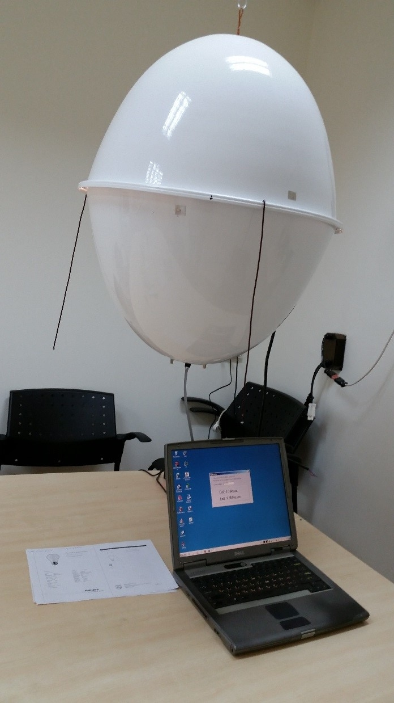
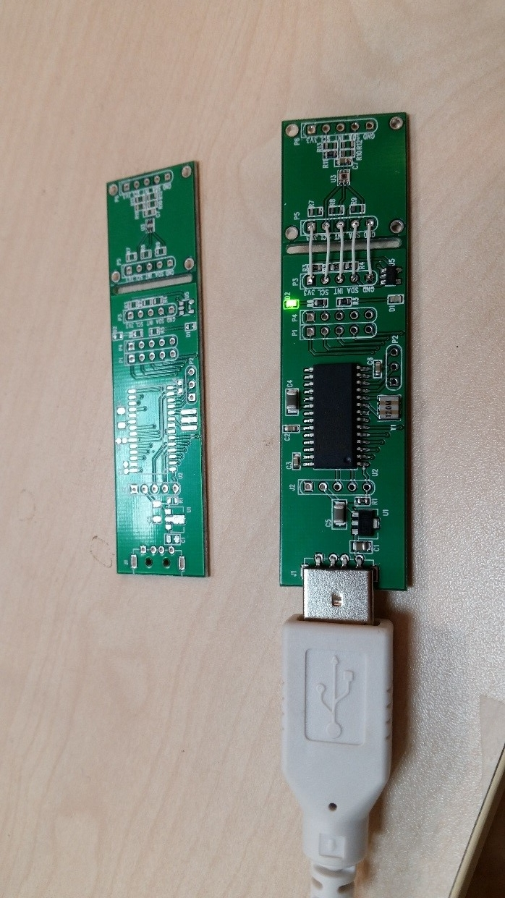
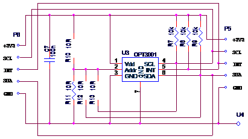
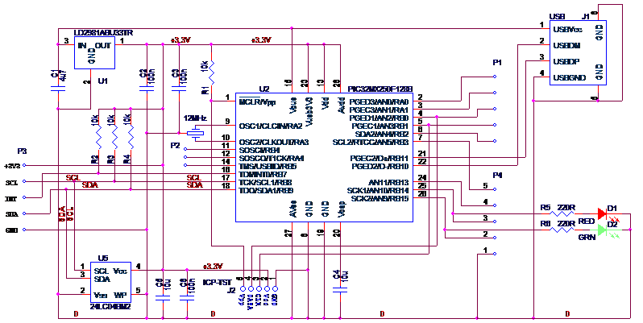
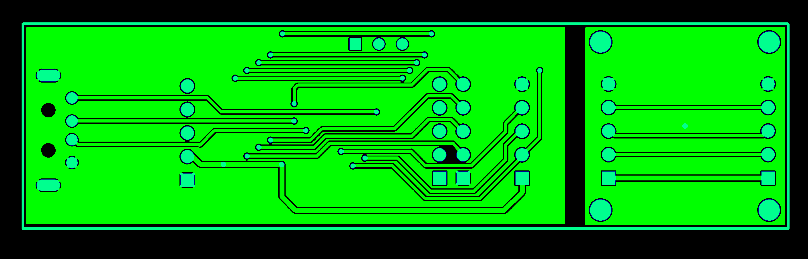
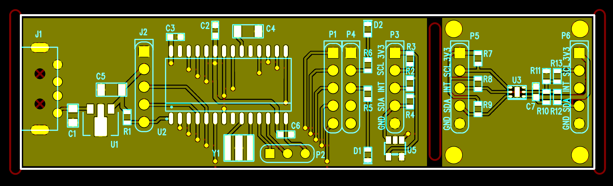
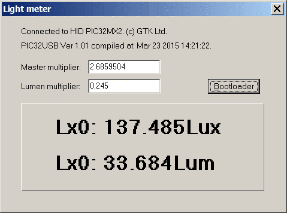
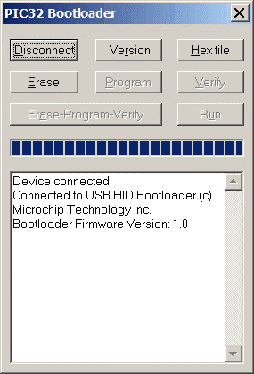

**Light meter project description.**

OPT3001 and PIC32MX2 based light meter used for simple light source efficacy measurement.

 

OPT3001 board schematic.

{width="3.4166666666666665in" height="1.9166666666666667in"}

R10..R13 -- I[^2]C address selection.

CPU board schematic

{width="6.641666666666667in" height="3.3333333333333335in"}

PCB layout.

Bottom:{width="6.728472222222222in" height="2.161111111111111in"}

Top:{width="6.728472222222222in" height="2.0416666666666665in"}

Firmware based on Microchip application library Generic HID demo and modified for PIC32 (<http://www.look4tech.com/pic32mx220-usb-project-demo-code/>).

 I[^2]C firmware don't use  I[^2]C hardware of PIC32 an can be easylly ported to any pins and CPU.

PC Win32 software is simple VCL application created with Borland (Embarcadero) C Builder

{width="3.9916666666666667in" height="2.966666666666667in"}

Bootloader based on Microchip application library and modified for entering boot mode due short SCL and SDA pins (or DATA (4) and CLK (3) pins on the ICP connector) before connect device to the USB port. Blinking green LED indicates bootloader mode. PC bootloader's part ported to C-builder VCL application from Microchip application note AN1388 (PIC32UBL).

{width="2.3919652230971127in" height="3.525in"}
